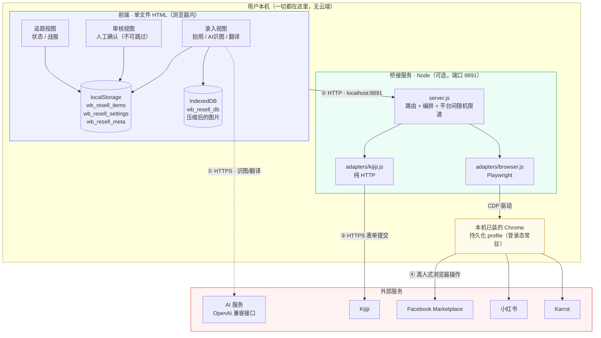
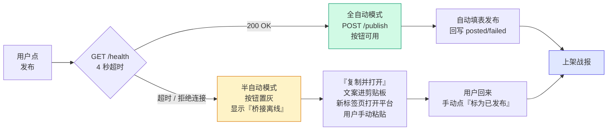
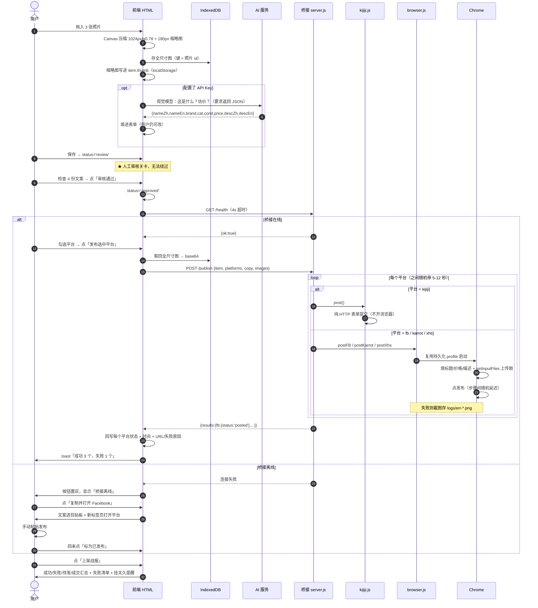

# DEV.md — 二手转卖工作台 技术设计文档

> **本文档的读者是 AI / 工程师，不是终端用户。**
> 终端用户请看 [README.md](./README.md)。
>
> 目的：让另一个 AI 在**零上下文**的情况下读完本文，就能理解这套系统为什么长这样、
> 每个模块负责什么、模块之间怎么通信、哪些地方是脆弱的、以及如何安全地扩展它。
>
> 最后更新：2026-08-01 · 状态：核心链路已实现并通过静态验证；浏览器适配器的**选择器未在真实账号上跑通**（见 §10 已知风险）

---

## 1. 项目速览

| 项目 | 内容 |
|------|------|
| **名称** | 二手转卖工作台（Secondhand Resale Workbench） |
| **解决的问题** | 把一件闲置物品同时挂到 6 个二手平台，需要重复填 6 次表单、写 6 种风格的文案、还要记住哪个平台发成功了。全过程约 15-20 分钟/件。 |
| **目标** | 压缩到 1-2 分钟/件，并且**不丢失哪件在哪个平台是什么状态**这个信息。 |
| **目标平台** | Facebook Marketplace、Kijiji、小红书、Karrot、闲鱼、Carousell |
| **目标用户** | 北美留学生 / 搬家清货的个人卖家。**非技术背景**。 |
| **形态** | 单文件 HTML（前端） + 可选的本地 Node 桥接服务（自动化） |
| **部署** | 前端双击即用，零安装；桥接服务需要 Node + Playwright |

### 1.1 一句话架构

> 一个**零依赖单文件前端**负责全部数据与人工审核，一个**可选的本机 Node 服务**负责真正的自动发帖；
> 前端在桥接离线时**自动降级**为半自动（复制文案 + 跳转平台），因此前端永远可用。

这个「**可选的自动化层**」是整个设计的核心取舍，理由见 §9 ADR-001。

---

## 2. 技术栈（精确清单）

### 2.1 前端 `index.html`

| 层 | 选型 | 版本/约束 | 为什么是它 |
|----|------|-----------|-----------|
| 结构 | 原生 HTML5 | 单文件，~78 KB | 零构建、零依赖、断网可用、可邮件传输 |
| 样式 | 原生 CSS3 + CSS 变量 | 内联 `<style>` | 无 Tailwind/Bootstrap。变量集中在 `:root` 便于换肤 |
| 逻辑 | 原生 ES2020 JavaScript | 内联 `<script>`，~47 K 字符，`'use strict'` | **无 React/Vue/jQuery**。见 ADR-002 |
| 结构化数据存储 | `localStorage` | key 前缀 `wb_resell_*` | 同步 API、够用（物品元数据是纯文本） |
| 图片存储 | `IndexedDB` | DB `wb_resell_db` / store `photos` | localStorage 只有 ~5 MB，装不下图片。见 ADR-003 |
| 图片压缩 | Canvas 2D `drawImage` + `toDataURL` | 主图 1024px / JPEG q=0.78；缩略图 180px | 纯浏览器端，不上传服务器 |
| 图标 | 内联 SVG `<path>` | 全部手写 | **严禁 emoji 当图标**（跨平台渲染不一致）；Karrot 用萝卜 SVG 而非 🥕 |
| 图表 | 内联 SVG + DOM | 手写 | 不引 Chart.js/D3 |
| 字体 | 系统字体栈 | `-apple-system, BlinkMacSystemFont, "Segoe UI", Roboto, sans-serif` | 不下载字体文件 |
| AI 调用 | `fetch` → OpenAI 兼容 `/chat/completions` | 用户自带 Base URL + Key | 见 §6 |
| 网络 | `fetch` + `AbortController` 超时 | — | 桥接探活 4s / 发布 10min |

**外部依赖数量：0。** 这是硬约束，任何改动都不得引入 CDN、Web Font、外部图片或第三方 JS。

### 2.2 桥接服务 `automation/bridge/`

| 层 | 选型 | 说明 |
|----|------|------|
| 运行时 | Node.js ≥ 18 | 需要内置 `fetch`（Kijiji 适配器用） |
| HTTP 服务 | Node 内置 `http` 模块 | **不用 Express**。只有 4 个端点，不值得引依赖 |
| 浏览器自动化 | `playwright` ^1.40 | 唯一的 npm 依赖 |
| 浏览器内核 | **用户已安装的 Chrome** | `executablePath` 指向本机 Chrome，**不下载 Chromium**（省 ~300MB，满足"轻量"要求） |
| 会话持久化 | `chromium.launchPersistentContext(userDataDir)` | 登录态存独立 profile 目录，见 ADR-005 |
| 配置 | `config.json` | 端口、Chrome 路径、profile 目录、限速、Kijiji 凭据 |
| 日志 | 追加写 `logs/bridge.log` + 失败截图 `logs/err-<平台>-<时间戳>.png` | 无日志库 |

**依赖树总计：1 个直接依赖（playwright）。**

### 2.3 文件清单

```
项目根/
├─ README.md                      给普通用户的图文教程（主页）
├─ DEV.md                         本文档
├─ outputs/
│  ├─ 二手转卖工作台.html          ★ 前端主体，单文件，可独立分发
│  └─ screenshots/                README 用的截图
└─ automation/bridge/
   ├─ server.js                   HTTP 路由 + 发布编排 + 限速
   ├─ config.json                 用户可改配置
   ├─ package.json                依赖声明
   ├─ start-bridge.bat / .sh      一键启动（自动装依赖）
   ├─ adapters/
   │  ├─ kijiji.js                纯 HTTP API 适配器（不开浏览器）
   │  └─ browser.js               Playwright 适配器（FB / Karrot / 小红书）
   └─ logs/                       运行日志 + 失败截图
```

---

## 3. 系统架构图



### 3.1 降级路径（桥接不在时）



**关键性质**：前端**从不假设**桥接存在。`checkBridge()` 在三个时机被调用（页面初始化、打开物品详情、保存设置），失败即静默降级，只改一个状态点的颜色。用户不会看到报错弹窗。

---

## 4. 通信矩阵

系统里一共有 **4 条通信链路**，协议和失败语义各不相同：

| # | 发起方 | 接收方 | 协议 | 载荷 | 超时 | 失败时的行为 |
|---|--------|--------|------|------|------|-------------|
| ① | 前端 JS | AI 服务（OpenAI 兼容） | HTTPS POST `/chat/completions` | 图片 base64 + 文本 prompt，要求**严格返回 JSON** | 浏览器默认 | toast 提示，用户改用手动填写。**不阻塞主流程** |
| ② | 前端 JS | 本机桥接 | HTTP `localhost:8891`，CORS `*` | JSON `{item, platforms[], copy{}, images[]}` | 探活 4s / 发布 10min | 降级为半自动，按钮置灰 |
| ③ | Kijiji 适配器 | Kijiji 服务器 | HTTPS 表单提交 | 分类 / 标题 / 描述 / 价格 / 图片 | 适配器内部 | 返回 `{status:'failed', message}`，**不影响其他平台** |
| ④ | Playwright | Chrome → 各平台 | CDP（本地）→ 平台 HTTPS | 模拟真人填表 | 每步 60s | 存失败截图，返回 `failed` |

### 4.1 桥接 API 契约（前后端唯一的耦合面）

改动这里必须同步改前端 `publishViaBridge()`。

```
GET  /health
  → 200 {ok:true, status:"online", platforms:["fb","kijiji","xhs","karrot"],
         profileDir:"...", kijiji:true, browser:true}
     kijiji / browser 字段表示对应适配器是否成功 require（playwright 没装时 browser:false）

GET  /login-status
  → 200 {ok:true, results:[{platform:"fb", loggedIn:true, cookieCount:12}, ...]}
     FB 判定依据：存在非空的 c_user cookie；其余平台：该域下有任意 cookie

POST /login/:platform          platform ∈ {fb, karrot, xhs}
  → 200 {ok:true, status:"pending", message:"..."}
     副作用：弹出 Chrome 并停在登录页，浏览器不会自动关闭（等用户登完）

POST /publish
  body {
    item:      {nameZh,nameEn,brand,price,cur,cond,cat,descZh,descEn,loc},
    platforms: ["fb","kijiji"],          // 用户勾选的子集
    copy:      { fb:{title,text}, ... }, // 前端生成好的文案，服务端不再加工
    images:    ["data:image/jpeg;base64,...", ...]   // 最多 8 张
  }
  → 200 {ok:true, results:{
           fb:     {ok:true,  status:"posted", url:"...", message:"..."},
           kijiji: {ok:false, status:"failed", message:"图片上传超时"}
         }}

  注意：即使部分平台失败，HTTP 状态码仍是 200。
       判定成功的唯一依据是 results[平台].status === 'posted'。
```

**设计要点：文案在前端生成，不在服务端生成。** 这样用户在审核界面**看到什么，就发出去什么**（所见即所发），避免"预览和实际不一致"这类最难排查的信任问题。

---

## 5. 核心业务流程（时序）



---

## 6. AI 集成设计

**双通道**，两个模型可以分开配：

| 通道 | 配置项 | 输入 | 输出 |
|------|--------|------|------|
| 识图 | `settings.modelV`（默认 `gpt-4o-mini`） | 压缩后的图片 base64 | 物品名/品牌/分类/成色/建议价/中英文描述 |
| 翻译 | `settings.modelT` | 中文名 + 中文描述 | 地道的北美二手平台英文 |

- **接口形态**：OpenAI 兼容 `/chat/completions`，用户自填 Base URL + Key，因此 DeepSeek / Kimi / 本地 Ollama / 中转站都能用。
- **鲁棒性**：模型经常在 JSON 外面裹 ```` ```json ````。`parseJSON()` 会先剥 code fence 再 `JSON.parse`，失败则 toast 提示并保留用户手填的值。
- **AI 永远是可选的**：没配 Key 时所有字段都能手填，主流程不受影响。这是刻意的 —— AI 是加速器，不是必需品。
- **隐私**：Key 只存在浏览器 localStorage，从不发给桥接服务或任何第三方。

### 6.1 本机 AI（Ollama / LM Studio）：免 Key、照片不出门

 用正则判断地址是否指向本机（ /  /  / ，末尾  锚定防  钓鱼）。命中即视为「本机模式」：

- ** 返回 true 且不要求 Key**（ 发 ）。
- 服务商选 Ollama 时，默认填 ，视觉模型 、文本模型 。
-  对**本机地址**单独分支：网络错误提示  跨域排查，404 提示 。

> **🔴 CORS 致命坑（真实踩过）**：双击本地 HTML 打开时页面  是 、Origin 头为 ，不在 Ollama 白名单（），被 403；现象是  通但浏览器 。
> 解决：[GIN] 2026/08/04 - 11:23:18 | 200 |       582.2µs |       127.0.0.1 | GET      "/api/tags"
[GIN] 2026/08/04 - 11:23:24 | 200 |            0s |       127.0.0.1 | GET      "/api/tags"
[GIN] 2026/08/04 - 11:23:44 | 200 |      1.0019ms |       127.0.0.1 | GET      "/api/tags"
[GIN] 2026/08/04 - 11:23:44 | 204 |            0s |       127.0.0.1 | OPTIONS  "/v1/chat/completions"
[GIN] 2026/08/04 - 11:23:44 | 400 |       868.4µs |       127.0.0.1 | POST     "/v1/chat/completions"
[GIN] 2026/08/04 - 12:13:34 | 403 |            0s |       127.0.0.1 | GET      "/api/tags"
[GIN] 2026/08/04 - 12:14:09 | 200 |       622.6µs |       127.0.0.1 | GET      "/api/version"
[GIN] 2026/08/04 - 12:14:10 | 200 |            0s |       127.0.0.1 | GET      "/api/version"
[GIN] 2026/08/04 - 12:14:10 | 200 |    136.0395ms |       127.0.0.1 | POST     "/api/me"
[GIN] 2026/08/04 - 12:14:10 | 200 |            0s |       127.0.0.1 | GET      "/api/experimental/model-recommendations"
[GIN] 2026/08/04 - 12:14:10 | 200 |            0s |       127.0.0.1 | GET      "/api/tags"
[GIN] 2026/08/04 - 12:14:10 | 200 |       525.8µs |       127.0.0.1 | GET      "/api/version"
[GIN] 2026/08/04 - 12:14:10 | 404 |      1.6284ms |       127.0.0.1 | POST     "/api/show"
[GIN] 2026/08/04 - 12:14:10 | 200 |     53.7912ms |       127.0.0.1 | POST     "/api/me"（Mac/Linux 同理设环境变量后再启动）。这是文档必须写清的用户痛点。


### 6.1 本机 AI（Ollama / LM Studio）：免 Key、照片不出门

`isLocalAI(url)` 用正则判断地址是否指向本机（`localhost` / `127.0.0.1` / `0.0.0.0` / `[::1]`，末尾 `(\/$|)` 锚定防 `localhost.evil.com` 钓鱼）。命中即视为「本机模式」：

- **`hasAI()` 返回 true 且不要求 Key**（`callAI` 发 `Authorization: Bearer local`）。
- 服务商选 Ollama 时，默认填 `http://localhost:11434/v1`，视觉模型 `qwen2.5vl`、文本模型 `qwen2.5`。
- `aiErr()` 对**本机地址**单独分支：网络错误提示 `OLLAMA_ORIGINS=*` 跨域排查，404 提示 `ollama pull <模型>`。

> **CORS 致命坑（真实踩过）**：双击本地 HTML 打开时页面 `origin` 是 `file://`、Origin 头为 `null`，不在 Ollama 白名单（`localhost/127.0.0.1/0.0.0.0`），被 403；现象是 `curl` 通但浏览器 `Failed to fetch`。
> 解决：`set OLLAMA_ORIGINS=* && ollama serve`（Mac/Linux 同理设环境变量后再启动）。这是文档必须写清的用户痛点。


---

## 7. 数据模型

### 7.1 `localStorage`

```jsonc
// key: wb_resell_items  →  Item[]
{
  "id": "itm_l2x9k_a8f3d",       // uid('itm') = 前缀 + base36 时间戳 + 随机
  "createdAt": "2026-08-01",
  "status": "review",             // review（待审核） | approved（已通过）
  "nameZh": "宜家 MICKE 书桌 白色",
  "nameEn": "IKEA MICKE Desk (White)",
  "brand": "IKEA",
  "cat": "家具",                  // 键在 CAT_EN 映射表里，用于生成英文文案
  "cond": "8成新",                // 键在 COND_EN 映射表里
  "price": 45,
  "descZh": "...",
  "descEn": "...",
  "loc": "Waterloo, ON",
  "thumb": "data:image/jpeg;base64,...",  // 180px 缩略图，列表直接渲染
  "photos": ["ph_xxx", "ph_yyy"],         // → IndexedDB 的键，全尺寸图不进 localStorage
  "platforms": {
    "fb":     {"state": "posted",  "at": "2026-07-25", "note": "", "url": "..."},
    "kijiji": {"state": "failed",  "at": "2026-07-25", "note": "图片上传超时"},
    "xhs":    {"state": "posted",  "at": "2026-07-25", "note": ""},
    "karrot": {"state": "pending", "at": "",           "note": ""}
  },
  "postedAt": "2026-07-25",
  "soldAt": "",
  "demo": true                    // 示例数据标记，「清空示例」只删这些
}
```

**平台状态机**：

```
pending ──发布成功──> posted ──标记成交──> sold
   │                    │
   └──发布失败──> failed ┘（重置回 pending 可重发）
   └──────────> skip（这个平台不发）
```

```jsonc
// key: wb_resell_settings
{
  "url": "https://api.openai.com/v1", "key": "",
  "modelV": "gpt-4o-mini", "modelT": "gpt-4o-mini",
  "cur": "CAD", "loc": "Waterloo, ON",
  "stale": 14,                     // 挂满几天提醒降价
  "contact": "",                   // 附在文案末尾
  "bridge": "http://localhost:8891"
}

// key: wb_resell_meta
{ "seeded": true, "lastBackupCount": 0 }   // seeded 防止清空后示例数据复活
```

### 7.2 IndexedDB

`wb_resell_db` / object store `photos` / 主键 `id`：`{id, dataUrl}`
存 1024px JPEG。删除物品时同步 `dbDel()` 每张图，避免孤儿数据。

### 7.3 导出格式

- **完整备份**：JSON，含图片 base64，可跨设备恢复
- **仅文字**：JSON，不含图，体积小，用于快速迁移
- **导入不限条数**（硬性要求，早期版本的常见缺陷）

---

## 8. 前端模块地图

`<script>` 内按注释分区，便于 AI 定位：

| 区块 | 主要函数 | 职责 |
|------|---------|------|
| `constants` | `PLATFORMS`、`COND_EN`、`CAT_EN`、`DEF_SET` | **加平台/分类只改这里** |
| `utils` | `$`、`uid`、`esc`、`today`、`toast` | `esc()` 用于所有插值，防 XSS |
| `indexeddb` | `dbPut/dbGet/dbDel/dbAll` | Promise 化封装，失败静默返回 null |
| `storage` | `load/save/saveSet` | 配额溢出时 toast 提示导出 |
| `photos` | `compress`、`addFiles` | Canvas 压缩 |
| `copy generator` | `buildCopy(it, pk)` | **六平台文案差异化的唯一来源**，见 §8.1 |
| `ai` | `callAI`、`parseJSON`、`aiRecognize`、`aiTranslate` | — |
| `views` | `renderCapture/renderReview/renderTrack`、`renderToday` | — |
| `detail` | `openDetail` | 编辑 + 六平台文案 + 发布条 |
| `bridge client` | `checkBridge`、`syncAutoBar`、`publishViaBridge` | **前端唯一与桥接对话的地方** |
| `report` | `buildReport` | 战报文本 |
| `settings` / `bind` / `seed` | — | `seed()` 预置 4 条示例（含 1 条失败、1 条挂 19 天） |

### 8.1 文案差异化策略

同一件物品，六个平台生成**六份不同的文案** —— 平台调性不同，复制粘贴同一份会显得很业余：

| 平台 | 语言 | 风格 | 特征 |
|------|------|------|------|
| Facebook | 英文 | 简洁、交易导向 | `Title/Price/Category/Condition` 结构化字段；结尾 "Cash or e-Transfer. Serious buyers only" |
| Kijiji | 英文 | 详细、信息完整 | 标题带成色 `Name — Good condition`；含 Location；鼓励提问 |
| 小红书 | **中文** | 口语、有情绪 | emoji + 5 个话题标签（`#二手转卖 #Waterloo二手 #留学生二手 #<分类> #低价出`） |
| Karrot | 英文 | 随和、邻里感 | 短句，社区口吻 |

`contactLine(lang)` 按语言追加联系方式。

---

## 9. 架构决策记录（ADR）

> 这一节是给未来 AI 的**最重要**部分：解释"为什么不那样做"，避免好心改坏。

### ADR-001：自动化层做成可选的旁路，而不是必需依赖
- **背景**：六个平台里只有 Kijiji 有可用的非官方 API，其余必须靠浏览器自动化，而浏览器自动化天然脆弱（平台随时改版）。
- **决策**：前端**完全不依赖**桥接。桥接在 → 全自动；桥接不在 → 半自动。
- **理由**：平台改版会让自动化在某天早上突然失效。如果前端强依赖桥接，那天用户就完全没法卖东西了。半自动虽然慢，但**永远不会坏**。
- **后果**：`buildCopy()` 的产物同时服务两条路径（复制粘贴 / 自动填表），必须保持纯函数、无副作用。

### ADR-002：不用任何前端框架
- **决策**：原生 JS + 字符串模板渲染。
- **理由**：(1) 用户是非技术背景，交付物必须是"双击就能开"的单个文件；(2) 引入框架就要引入构建，交付物变成 dist 目录，用户会搞丢文件；(3) 这个应用的状态复杂度（约 15 个字段 × 4 平台状态）远没到需要框架的程度。
- **代价**：`render()` 是全量重绘。物品数量到**数千条**时会卡。届时的解法是列表虚拟化，而不是引入框架。

### ADR-003：图片存 IndexedDB，缩略图存 localStorage
- **背景**：localStorage 上限约 5 MB，一张 1024px JPEG 约 150-300 KB，存 20 张就爆。
- **决策**：全尺寸图进 IndexedDB（键存在 `item.photos[]`），180px 缩略图（约 6 KB）进 localStorage。
- **理由**：列表渲染只需要缩略图，且必须**同步**可用（避免闪烁）。全尺寸图只在详情页和发布时按需异步取。

### ADR-004：人工审核关卡不可跳过
- **决策**：物品必须 `status='review'` → 人工确认 → `approved` 才能发布。AI 识别的结果**绝不自动发布**。
- **理由**：用户明确要求。且 AI 估价经常离谱（把二手书估成 $80），直接发出去是真金白银的损失。

### ADR-005：Playwright 用 `launchPersistentContext` + 独立 profile
- **决策**：不用 `chromium.launch()`，而用 `chromium.launchPersistentContext(profileDir, opts)`。
- **理由**：**`chromium.launch()` 会静默忽略 `userDataDir` 参数** —— 这是开发过程中真实踩到的 bug，会导致每次发布都要求重新登录，自动化形同虚设。
- **为什么用独立 profile 而不是用户默认 Chrome profile**：(1) 用户日常 Chrome 正开着时，Playwright 无法占用同一个 profile 目录，会直接报错；(2) 隔离能避免自动化脚本误碰用户的日常浏览数据。**代价是首次要在这个独立 profile 里单独登录一次。**
- **为什么 `headless: false`**：无头浏览器指纹明显，各平台风控识别率高。有头模式风险低，且用户能亲眼看到在做什么（信任感）。

### ADR-006：文案在前端生成，服务端不加工
- **决策**：`copy` 对象由前端 `buildCopy()` 生成后**原样**传给桥接。
- **理由**：所见即所发。如果服务端二次加工，用户审核时看到的和实际发出去的可能不一致 —— 这类 bug 极难排查，且直接摧毁用户信任。

### ADR-007：平台之间随机限速 5-12 秒
- **决策**：`server.js` 在每两个平台之间 `sleep(rand(5000, 12000))`。
- **理由**：连续瞬时发帖是最典型的机器人特征。随机化间隔比固定间隔更像真人。
- **代价**：发 4 个平台总耗时约 1-2 分钟。这是刻意的取舍 —— **账号安全 > 速度**。

---

## 10. 已知风险与限制

> **请务必如实向用户传达这些，不要粉饰。**

### 🔴 高：浏览器适配器的选择器未经真实账号验证
`adapters/browser.js` 里 FB / Karrot / 小红书 的选择器是**基于已知页面结构编写的，尚未在真实账号上跑通**。
- 各平台会 A/B 测试、按地区/语言给不同 DOM，选择器很可能第一次就对不上。
- 每个发布函数都包在 try/catch 里，失败会存截图到 `logs/err-<平台>-<时间戳>.png`。
- **首次使用必然需要按截图调选择器。** 这不是缺陷，是这类方案的固有属性。
- **缓解**：失败只影响该平台，其余平台照常；且随时能退回半自动。

### 🔴 高：Facebook / Karrot 有封号风险
自动化操作违反两家的服务条款。已做的缓解：有头浏览器、随机限速、真人式操作节奏。
**但风险无法归零。** 用户必须知情后自行决定。小红书相对宽松，Kijiji 走 API 风险最低。

### 🟡 中：Kijiji 用的是非官方 API
Kijiji 没有公开 API，适配器复刻的是网页表单提交流程。官方改版即失效。

### 🟡 中：localStorage 容量天花板
约 5 MB。物品元数据很省，但**缩略图**会累积。约 300-500 件后可能触顶，届时会 toast 提示导出清理。

### 🟢 低：全量重绘性能
数千条时列表渲染变慢。解法是虚拟化。

### 其他边界
- **桥接只能本机用**：绑定 `127.0.0.1`。云端部署的页面调不到本机服务，只能半自动。这是安全设计，不是缺陷。
- **无多用户/账号体系**：单人本地工具，靠导出 JSON 迁移。
- **无定时/自动重发**：失败项需用户手动点重试。

---

## 11. 扩展指南

### 11.1 加第五个平台（例：Craigslist）

1. **前端**：`PLATFORMS` 数组加一项
   ```js
   {k:'cl', n:'Craigslist', full:'Craigslist', cls:'cl', ab:'C',
    lang:'en', url:'https://post.craigslist.org/'}
   ```
2. **前端**：`buildCopy()` 加 `if(pk==='cl'){...}` 分支
3. **前端**：CSS 加 `.plogo.cl{background:...}`
4. **桥接**：`config.json` 的 `platforms` 数组加 `"cl"`
5. **桥接**：写适配器 —— **优先查有没有 API，没有再上 Playwright**
6. **桥接**：`server.js` 的 `handlePublish` 里挂上分发

界面、状态机、战报、导入导出会**自动**支持新平台（全部由 `PLATFORMS` 驱动）。

### 11.2 修复失效的选择器

1. 复现失败，看 `logs/err-<平台>-*.png` 截图
2. 手动打开该平台发布页，DevTools 找当前真实选择器
3. 改 `adapters/browser.js` 对应函数
4. **优先用 `getByRole` / `getByPlaceholder`**（语义化，抗改版），少用 CSS 类名（平台的类名通常是混淆过的随机串）

### 11.3 换成别的自动化后端

`adapters/` 下每个模块只需导出符合契约的函数：

```js
async function post(cfg, {item, copy, images}, log)
  → {ok: boolean, status: 'posted'|'failed', url?: string, message: string}
```

想换成小红书的现成 MCP（`xiaohongshu-mcp`，Go 单文件，Streamable HTTP 在 `:18060/mcp`），
只需把 `postXhs` 改成向该 MCP 发请求，其余代码零改动。**这是推荐的演进方向** ——
MCP 由社区维护选择器，比自己维护 Playwright 脚本可持续得多。

---

## 12. 调试手册

| 症状 | 排查方向 |
|------|---------|
| 状态点一直是灰/红 | 桥接没起。终端跑 `node server.js` 看报错；确认端口 8891 没被占；确认设置里的地址和实际端口一致 |
| `/health` 返回 `browser:false` | playwright 没装好。到 `automation/bridge` 跑 `npm install` |
| 发布时浏览器没弹出 | 检查 `config.json` 的 `chromeExecutable` 路径是否真实存在 |
| 每次都要求重新登录 | profile 目录没有写权限，或被改回了 `chromium.launch()`（见 ADR-005） |
| 某平台一直 failed | 看 `logs/err-<平台>-*.png`，八成是选择器失效 |
| 图片没传上去 | 平台的 `input[type=file]` 可能是动态插入的；需要先点上传按钮再取 input |
| AI 返回解析失败 | 模型没按 JSON 输出。换个模型，或加强 prompt 里的"严格只输出 JSON" |
| 保存时提示存储已满 | localStorage 满了。导出备份后删旧物品 |

**日志位置**：`automation/bridge/logs/bridge.log`（全量）、`logs/err-*.png`（失败现场截图）

---

## 13. 给接手的 AI 的备注

1. **先读 §9 ADR 再改代码。** 很多看起来"可以优化"的地方（不用框架、全量重绘、桥接可选）都是刻意取舍，不是技术债。
2. **零外部依赖是硬约束。** 前端任何改动都不得引入 CDN / Web Font / 第三方 JS。这条被违反过一次，代价是用户保存 HTML 后页面直接白屏。
3. **改桥接 API 契约要同步改前端** `publishViaBridge()`，两边字段名必须一致（曾出现过 `err` vs `note` 字段名不一致的 bug）。
4. **不要移除人工审核关卡**（ADR-004），这是用户的明确要求。
5. **对用户诚实**：浏览器自动化会坏、有封号风险。不要宣称"100% 全自动稳定运行"。
6. **修改后的验证方式**：
   ```bash
   # 提取内联 JS 做语法检查（HTML 单文件无法直接 lint）
   node -e "const fs=require('fs');const h=fs.readFileSync('index.html','utf8');fs.writeFileSync('.check.js',h.match(/<script>([\s\S]*)<\/script>/)[1])"
   node --check .check.js

   # 桥接各文件
   node --check automation/bridge/server.js
   node --check automation/bridge/adapters/*.js
   ```
7. **用 Playwright 验证页面时的两个坑**：
   - 顶部 Tab 和底部移动导航有**相同的 `data-v` 属性**，直接按 `data-v` 点会触发 strict mode violation。用 `.tabs button[data-v="review"]` 这种更精确的选择器。
   - Playwright MCP **禁止 `file://` 协议**。验证时需起个本地静态服务器承载 HTML。
