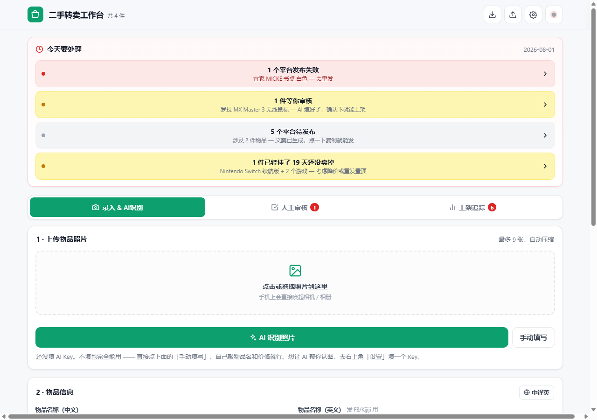
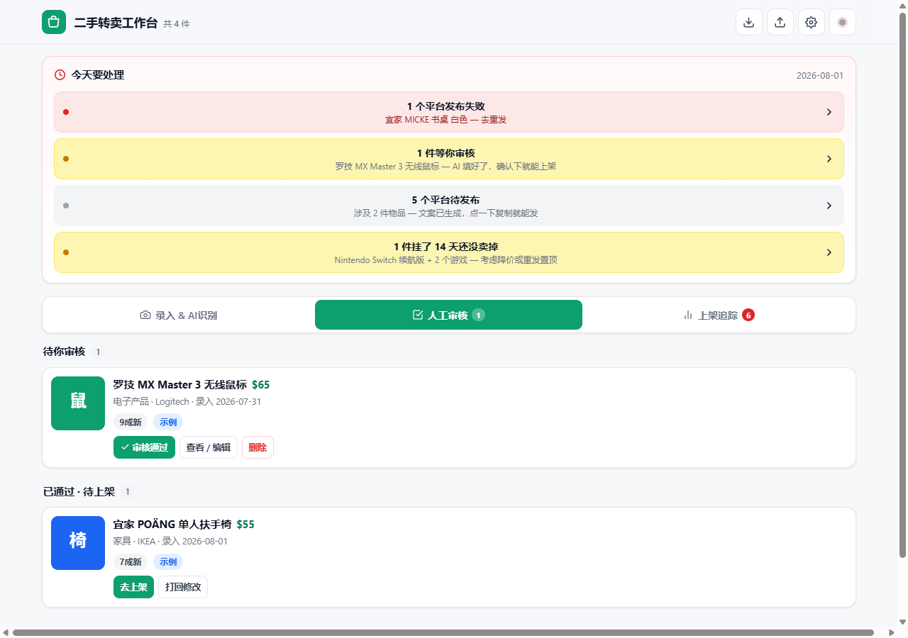
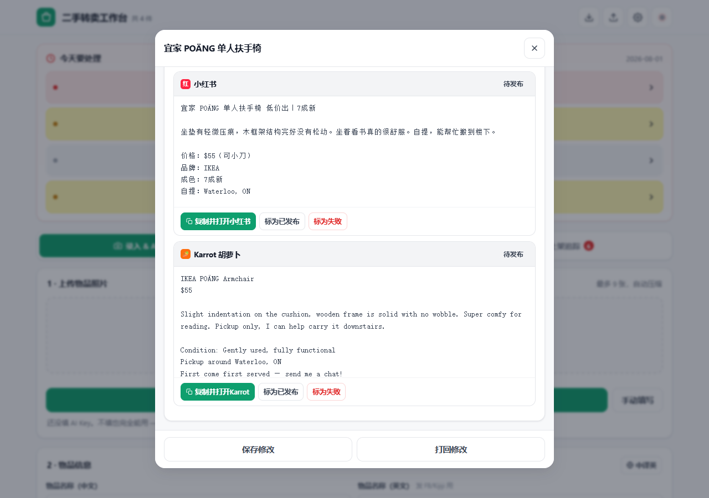
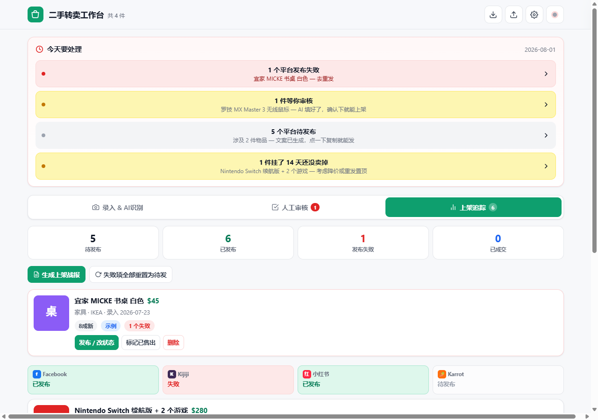
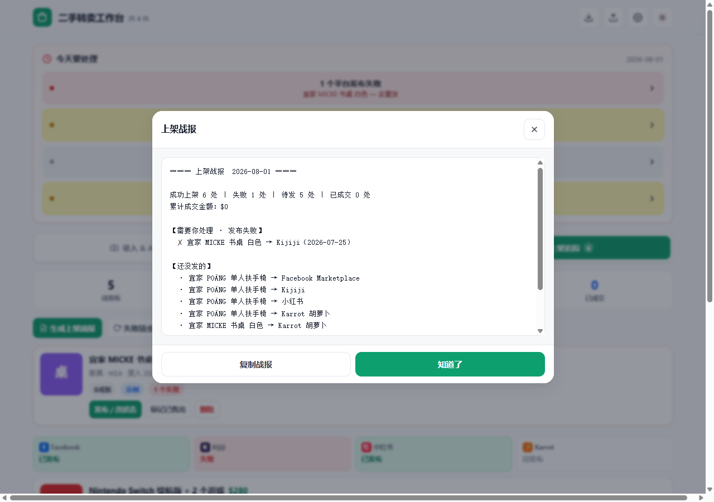
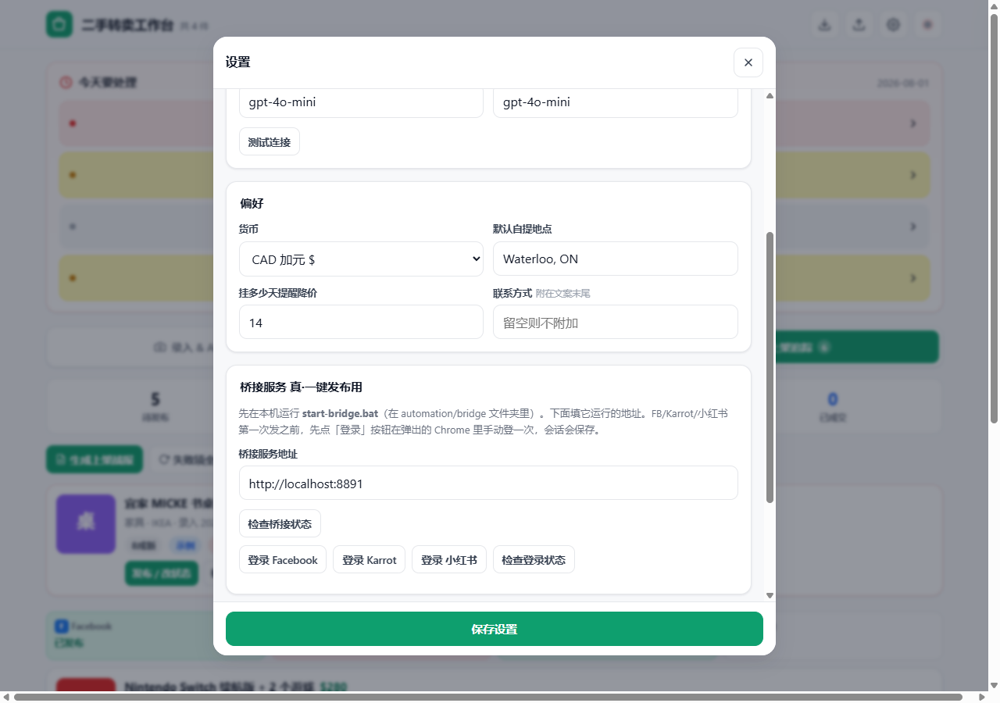
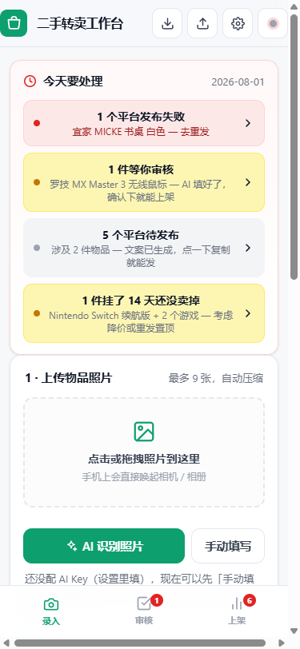

# 二手转卖工作台 · Resell Workbench

**把家里的闲置东西，一次性挂到 4 个二手平台。**

拍张照 → 让 AI 帮你写好文案 → 你看一眼确认 → 发布到 Facebook、Kijiji、小红书、Karrot。

[](./LICENSE)
[](#)


**🌐 在线版：** [hairuoliu.github.io/resell-workbench](https://hairuoliu.github.io/resell-workbench/) （点开即用，数据存你浏览器）

> 🔒 **隐私承诺：** 没有后端服务器。照片、API Key、所有物品数据全部存在**你自己的浏览器**里。
> 关掉页面不会丢，换设备要用「导出备份」搬过去。

---

## 这个东西能帮你省什么

如果你搬过家、清过货，你大概经历过这些：

- 同一件桌子，要在 4 个平台各填一遍表单 😩
- 英文文案写得干巴巴，发出去没人问
- 发了一堆东西，过两周完全想不起来"这个椅子到底在哪个平台挂过"
- 某个平台其实发失败了，你压根不知道

**这个工作台就是来解决这些的。** 一件东西录一次，四个平台的文案自动生成好，
每个平台发成功还是失败一目了然。

> 原来一件东西要折腾 **15-20 分钟**，现在大概 **1-2 分钟**。

---

## 开始之前，先放心

在你担心之前，先说清楚三件事：

| 你可能担心的 | 实际情况 |
|---|---|
| 要不要安装什么软件？ | **不用。** 就是一个文件，双击用浏览器打开就行 |
| 我的数据会传到网上吗？ | **不会。** 全部存在你自己电脑的浏览器里，没有服务器 |
| 会不会很难，我不会用？ | 界面就三步：录入 → 审核 → 发布。跟着下面的图走就行 |

---

## ⚡ 安装 / 开始用

### 方式一：在线版（最省事，**推荐**）

点这个链接就能直接用 —— 不下载、不安装：

> **https://hairuoliu.github.io/resell-workbench/**

第一次打开会跳出一个 4 步的引导，问你三件事：
1. 在哪自提（自动填进文案）
2. 用什么货币
3. 要不要让 AI 帮你写（要填 API Key，没有也能用）

填完一次就再也不用填了。下次打开直接进主页。

> 📱 **手机用**：用 Safari（iPhone）或 Chrome（安卓）打开上面的链接，点「分享 → 添加到主屏幕」，桌面会出现一个图标，跟真的 APP 一样。

### 方式二：下载到本地（想完全离线 / 想改代码用）

1. 进 [Releases 页面](https://github.com/HairuoLiu/resell-workbench/releases) 下载 `index.html` 一个文件即可
2. **双击**它（Chrome / Edge / Safari 都能开）
3. 第一次同样会跑那个 4 步引导

> 完全离线，断网也能用。

### 进阶：要让 FB/Karrot/小红书全自动发布（方式 B）？

需要在你电脑上启动一个本地服务：

```bash
git clone https://github.com/HairuoLiu/resell-workbench.git
cd resell-workbench/automation/bridge
npm install
node server.js
```

启动后工作台右上角小圆点会变绿 🟢，详细说明见 [DEV.md](./DEV.md)。

### 📋 第一次用之前，你需要准备好这些

| 必填 | 用途 |
|---|---|
| 🌍 自提地点 | 自动填进每条文案（例：`Waterloo, ON`） |
| 💱 货币 | CAD / USD / CNY 三选一 |

| 选填 | 用途 / 推荐 |
|---|---|
| 🤖 API Key | 让 AI 帮你识别物品和写文案。**没填也能用，只是所有内容要自己手打**。<br>推荐：**DeepSeek**（便宜中文友好）、**OpenAI**、**通义千问**、**Kimi**，或本地 Ollama |
| 📞 联系方式 | 附在文案末尾（微信 / 邮箱 / 电话，留空则不加） |
| ⏰ 降价提醒 | 挂多少天提醒，默认 14 天 |

> 第一次填完之后存在浏览器里，下次打开直接用 —— 不会反复问你。

---

## 第一步：打开它

找到 **`index.html`** 这个文件，**双击它**。

它会用你的浏览器打开（Chrome、Edge 都行）。就这样，没有第二步。

打开后你会看到已经有 **4 件示例物品**（一张桌子、一个鼠标、一把椅子、一台 Switch）——
这些是我放进去让你看效果的假数据，你随时可以在设置里一键清掉。



### 认识一下这个界面

最上面那块 **「今天要处理」** 是整个工作台最重要的地方。
每次打开，它都会自动告诉你现在该干什么：

- 🔴 **红色的** = 出问题了，比如某个平台发布失败
- 🟡 **黄色的** = 挂太久没卖掉，可以考虑降价了
- ⚪ **灰色的** = 还在等你审核

**你不用记任何事情。** 打开就看见该做什么。

再往下是三个页面，点顶部就能切换（手机上在底部）：

| 页面 | 干什么用 |
|------|---------|
| **录入** | 拍照、填信息、让 AI 帮你识别 |
| **审核** | 你亲自检查一遍，确认没问题 |
| **追踪** | 看每件东西在每个平台什么状态 |

---

## 第二步：录入一件东西

### 2.1 放照片

把手机拍的照片**直接拖进**页面上那个虚线框，或者点一下选文件。

> 💡 **小提示**：照片会自动压缩，不会把你的浏览器撑爆。第一张照片会成为封面。

### 2.2 让 AI 帮你写（可选，但很省事）

点 **「AI 识别」**，它会看着你的照片自动填好：

- 这是什么东西（中文名 + 英文名）
- 什么牌子、什么分类
- 成色几成新
- **建议卖多少钱**
- 中文描述 + 英文描述

**AI 填完你还能随便改**，它只是帮你省下打字的功夫。

> ⚠️ **要用 AI 需要先填一个 Key**（相当于 AI 服务的通行证）。
> 点右上角齿轮 ⚙️ → 填进去 → 保存。
>
> **没有 Key 也完全不影响使用** —— 所有内容你自己手打就行，功能一模一样。

### 2.3 中译英

如果你只写了中文，点 **「中译英」**，AI 会翻译成**北美人真的会那样说**的英文
（不是那种一看就是机翻的味道）。

填完点 **「保存」**，这件东西就进入审核了。

---

## 第三步：审核（这一步不能跳）

切到 **「审核」** 页面，点开刚才那件东西。



**为什么一定要有这一步？**

因为 AI 会看走眼。它可能把你 300 块买的东西估成 30 块，
也可能把品牌认错。**这是真金白银的事，必须你自己过一眼。**

检查这些：
- ✅ 名字对不对
- ✅ **价格是不是你想卖的价**（最重要）
- ✅ 描述有没有胡说八道
- ✅ 自提地点对不对

改完点 **「审核通过」**。

---

## 第四步：发布到四个平台

审核通过后再点开它，你会看到**四份不一样的文案**：



**为什么是四份不一样的？**

因为每个平台的调性完全不同 —— 同一份文案复制四遍，一看就很业余：

| 平台 | 文案风格 |
|------|---------|
| **Facebook** | 英文，简洁直接，"诚心要的私信我" |
| **Kijiji** | 英文，信息详细，标题带成色 |
| **小红书** | **中文**，口语化，带 emoji 和 `#话题标签` |
| **Karrot** | 英文，轻松随和，邻里聊天的感觉 |

### 发布有两种方式

#### 方式 A：复制粘贴（默认，最稳）

点 **「复制并打开 Facebook」**：
1. 文案自动进你的剪贴板
2. 自动打开 Facebook 的发布页
3. 你在那边 `Ctrl+V` 粘贴，把照片拖进去
4. 发完回来点 **「标为已发布」**

四个平台重复一遍就完事了。

> 💡 照片可以点 **「下载全部原图」** 一次性存到电脑，然后直接拖进平台。

#### 方式 B：真·一键全自动（进阶，可选）

如果你启动了「桥接服务」（见下面的进阶章节），
勾选想发的平台，点一下 **「发布选中平台」**，
它会自动打开浏览器，**自己填表、自己上传照片、自己点发布**。

你就在旁边看着就行。

> 没启动桥接服务时，这个按钮是**灰色的**，会显示「桥接离线」——
> 这很正常，不是坏了，用上面的方式 A 就行。

---

## 第五步：追踪状态 + 看战报

切到 **「追踪」** 页面，每件东西在每个平台的状态一目了然：



- **待发布** — 还没发
- **已发布** — 发出去了
- **失败** — 出问题了，得重发
- **已售出** — 卖掉了 🎉

### 上架战报

点 **「上架战报」**，它会生成一份总结：



告诉你：成功几个、失败几个、哪些还没发、
**哪些挂太久了该降价**、总共卖了多少钱。

失败的东西，点 **「重试全部失败」** 就能一键重置，重新发一遍。

---

## ⚠️ 最重要的一件事：备份

**你的数据存在浏览器里。清理浏览器缓存 = 数据全没。**

所以请养成习惯：

> 每隔一段时间，点一下顶部的 **「导出备份」**，
> 会下载一个文件，存到网盘或者 U 盘。

万一哪天数据没了，点 **「导入恢复」** 选中那个文件，全部回来。



在设置里（右上角齿轮 ⚙️）你还能：
- 换货币（加元 / 美元 / 人民币）
- 改默认自提地点
- 设置"挂多少天提醒降价"
- 填联系方式（自动附在每条文案末尾）
- **清空示例数据**（把我预置的 4 条假数据删掉）

---

## 在手机上用

这个工作台在手机上也完全能用，而且可以**变成一个 APP 图标**：



**iPhone**：用 Safari 打开 → 点底部分享按钮 → 「添加到主屏幕」
**安卓**：用 Chrome 打开 → 右上角菜单 → 「添加到主屏幕」

之后点桌面图标就能直接打开，跟真的 APP 一样。

> 注意：手机和电脑上的数据是**分开的**，不会自动同步。
> 想同步就用「导出备份 → 导入恢复」搬过去。

---

## 进阶：打开「真·一键全自动」

> **这部分是可选的。不做也完全不影响使用**，只是需要多复制粘贴几下。
>
> 如果你觉得下面的步骤看不懂，**跳过就好** —— 方式 A 一样能把东西卖出去。

### 需要准备

在电脑上装一个叫 **Node.js** 的东西（去 [nodejs.org](https://nodejs.org) 下载，
一路点下一步即可）。

### 启动

1. 打开 `automation/bridge` 文件夹
2. **双击 `start-bridge.bat`**
3. 会弹出一个黑色窗口，等它自己装完东西（第一次要几分钟）
4. 看到 `listening on http://127.0.0.1:8891` 就成功了
5. **别关这个黑窗口**，关了就停了

回到工作台，右上角那个小圆点会**从灰色变成绿色** 🟢 —— 说明连上了。

### 第一次要先登录

点 ⚙️ 设置 → 找到「桥接服务」那块 → 分别点
**「登录 Facebook」「登录 Karrot」「登录 小红书」**。

每点一个会弹出浏览器，你**手动登录一次**，登完关掉窗口就行。
以后它就记住了，不用再登。

> 这是一个**独立的浏览器窗口**，跟你平时用的 Chrome 是分开的，
> 所以即使你平时已经登录了，这里还是要单独登一次。

### 然后就可以了

回到任何一件已审核的东西，勾选平台，点 **「发布选中平台」**，
剩下的交给它。发四个平台大概要 1-2 分钟
（中间会故意停几秒，是为了不被平台当成机器人）。

### 关于风险，我必须跟你说实话

- **自动发帖是违反 Facebook 和 Karrot 的使用条款的**，理论上有被封号的风险。
  我已经做了一些保护（真人操作节奏、随机停顿、用真实浏览器），但**风险没法降到零**。
- **平台随时可能改版**，改了之后自动发布就会失败。失败时它会自动截图存到
  `automation/bridge/logs/` 文件夹，方便排查。
- **如果你的账号很重要，建议就用方式 A 手动发**，稳妥。

自动化只是省事，不是必需品。**你自己决定值不值。**

---

## 常见问题

**Q：我不小心把数据弄丢了怎么办？**
A：如果之前导出过备份，点「导入恢复」选那个文件就能全回来。所以真的要养成导出的习惯。

**Q：那 4 条示例数据怎么删？**
A：⚙️ 设置 → 数据 → 「清空示例数据」。只删示例，你自己录的不受影响。

**Q：不填 AI 的 Key 能用吗？**
A：能，所有功能都在，只是要自己打字，AI 识别和翻译那两个按钮用不了。

**Q：第一次那个引导能再跑一遍吗？**
A：能。⚙️ 设置 → 「其他」→ 「重新运行首次设置向导」。

**Q：右上角圆点一直是灰的 / 红的？**
A：说明桥接服务没启动。如果你不用全自动功能，**这完全不影响**，忽略它就行。

**Q：可以分享给朋友用吗？**
A：可以，把那个 HTML 文件发给他就行。但**数据不会跟着走**，他打开是全新的。

**Q：能同时管理很多东西吗？**
A：几百件没问题。超过大概 300-500 件时它会提醒你导出备份、清理已卖掉的。

**Q：我会不会点错什么把它搞坏？**
A：基本不会。删除类操作都要**二次确认**，清空全部数据要确认**两次**。
放心点，实在不行还有备份。

---

## 遇到问题

- 页面白屏 / 显示不正常 → 换 Chrome 或 Edge 打开试试
- 数据不见了 → 检查是不是清理了浏览器缓存；用备份恢复
- 自动发布一直失败 → 看 `automation/bridge/logs/` 里的截图，多半是平台改版了
- 想了解技术细节 → 看 [DEV.md](./DEV.md)（面向开发者/AI，普通用户不用看）

---

## 给愿意折腾的人

```text
.
├── index.html              ← 主应用（也是 GitHub Pages 的入口）
├── README.md               ← 你正在看的
├── DEV.md                  ← 技术文档（架构图 / ADR / 通信矩阵）
├── LICENSE                 ← MIT
├── docs/screenshots/       ← README 引用的截图
└── automation/bridge/      ← 可选：真·一键发布的本机桥接服务
    ├── server.js           ← 内置 http 端口 8891
    ├── adapters/           ← Kijiji (纯 HTTP) + FB/Karrot/小红书 (Playwright)
    ├── config.json         ← 端口和 Chrome 路径
    ├── package.json
    ├── start-bridge.bat    ← Windows 一键启动
    └── start-bridge.sh     ← Mac/Linux 一键启动
```

### 本地启动桥接（可选）

不启动这个也能用方式 A（复制粘贴）发布；启动后多了方式 B（真·一键全自动）。

```bash
cd automation/bridge
npm install          # 第一次要装 playwright
node server.js       # 或双击 start-bridge.bat
# 看到 "listening on http://127.0.0.1:8891" 就 OK
```

详见 [DEV.md](./DEV.md)。

### 想要完全自部署？

```bash
git clone https://github.com/HairuoLiu/resell-workbench.git
cd resell-workbench
# 直接双击 index.html 就跑起来了
```

不需要 `npm install`，单文件应用零依赖。

---

**祝你东西都卖个好价钱** 🎉
